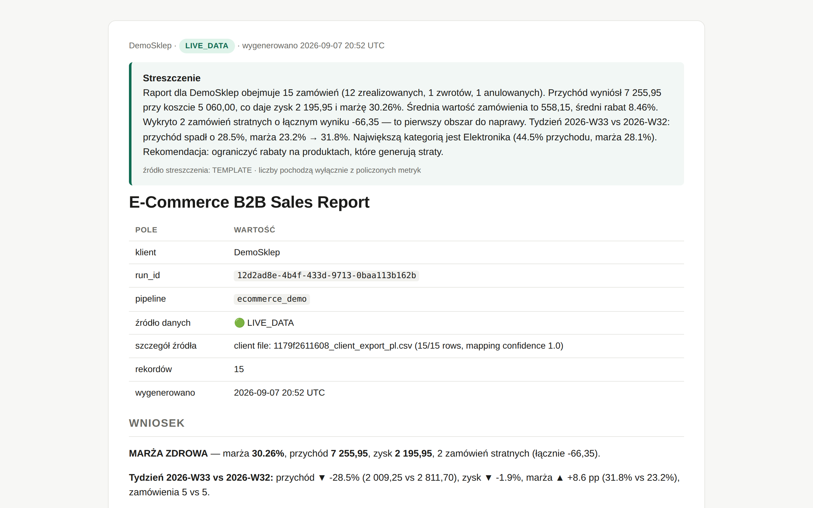
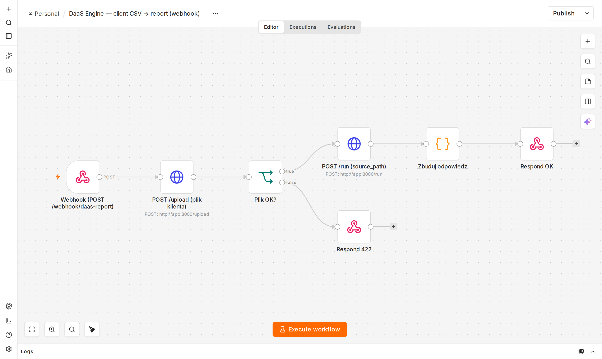

# DaaS Engine — automatyczny raport tygodniowy z Twoich danych

**Wysyłasz eksport CSV/XLSX ze sklepu, CRM-a albo księgowości → dostajesz gotowy raport HTML.
Co tydzień, automatycznie, bez ręcznego składania w Excelu.**

▶ **[Demo wideo — 50 s](docs/daas_demo.mp4)** (bez dźwięku, wystarczy obejrzeć)

Co liczy: przychód, koszt, marża, średnia wartość zamówienia, zwroty, top produkty i kategorie,
porównanie tydzień do tygodnia, zamówienia stratne i anomalie — plus sekcja **PRAKTYCZNE WNIOSKI**
z konkretnymi akcjami. Liczby pochodzą wyłącznie z Twojego pliku; nic nie jest generowane „z głowy".

Radzi sobie z realnymi polskimi eksportami: separator `;`, kwoty `1 299,00 zł`, rabaty `30%`,
statusy `Zrealizowane / Zwrot / Anulowane`, kodowanie `cp1250`, nagłówki po polsku i angielsku.

Dostawa: uruchamiane przyciskiem (webhook n8n) albo automatycznie wg harmonogramu, z alertem przy
spadku przychodu ≥15% lub marży ≥3 pp. Dostajesz kod źródłowy i workflow — rozwiązanie jest Twoje.
Możesz hostować u siebie (Docker) albo zlecić hosting.

*In short (EN): upload any messy sales export (CSV/XLSX) → get an automated weekly HTML report with
KPIs, week-over-week deltas, loss-making orders and anomaly flags. FastAPI + DuckDB + n8n, tests included.*

Kontakt: prochpc@gmail.com

---

## Dokumentacja techniczna

Silnik analityczny, który bierze dane z dowolnego źródła (API / CSV / fixtures), liczy metryki biznesowe i generuje raport JSON + Markdown — orkiestrowany przez n8n, sterowany przez HTTP.

Stack: **FastAPI · DuckDB · pandas · n8n · Docker Compose**. Python 3.11.

Dwa pipeline'y demo na jednym silniku (ta sama baza, ten sam kontrakt API):

| pipeline | domena | metryki | źródło LIVE | fallback |
|---|---|---|---|---|
| `cs2_demo` | esports (portfolio) | win rate, K/D, rating, ADR, HS%, form score, breakdown map | FACEIT Data API (`FACEIT_API_KEY` + `FACEIT_PLAYER_NICKNAME`) | `data/fixtures/cs2_matches.json` |
| `ecommerce_demo` | e-commerce B2B | zamówienia, przychód, koszt, zysk, marża %, AOV, zamówienia stratne, anomalie, top kategorie/produkty | Apify dataset (`APIFY_TOKEN` + `APIFY_DATASET_ID`) lub własny CSV (`ECOMMERCE_CSV_PATH`) | `data/fixtures/ecommerce_orders.csv` |

**Zasada nr 1: brak klucza nie jest błędem.** Pipeline automatycznie przełącza się na fixtures i oznacza wynik jako `MOCK_DATA`. Wszystko działa od pierwszego `docker compose up` bez żadnego sekretu.



*Powyżej: raport z przykładowego eksportu sklepu (15 zamówień) — od uploadu pliku do gotowego HTML w < 1 s, bez ręcznej roboty. Pełny raport: `runtime/reports/<pipeline>_latest.html` po pierwszym runie.*

**Zasada nr 2 (v0.2): plik klienta zamiast integracji.** `POST /upload` przyjmuje dowolny eksport CSV/XLSX (Allegro, Shoper, WooCommerce, Baselinker, Excel "po swojemu" — polskie nagłówki, `1 299,00 zł`, `30%`, `Zrealizowane`), mapuje kolumny heurystycznie i zwraca gotowy payload do `POST /run`. Wynik = `LIVE_DATA`, raport HTML pod linkiem. Demo dla klienta: 2 requesty, zero kodu.

---

## Architektura

```
┌──────────────┐   POST http://app:8000/run    ┌───────────────────────────────┐
│     n8n      │ ────────────────────────────▶ │        app (FastAPI)          │
│ Manual/Cron  │ ◀──────────────────────────── │                               │
│ Format+Alert │      JSON RunResult           │  routes ─▶ PipelineRunner     │
└──────────────┘                               │              │                │
       sieć docker: daas_network               │   ┌──────────┼──────────┐     │
                                               │   ▼          ▼          ▼     │
                                               │ sources   transforms  reporting│
                                               │ (LIVE →   (pandas)    (JSON+MD)│
                                               │  fixture)                     │
                                               │        └──▶ DuckDB ◀──┘        │
                                               │        runtime/daas.duckdb    │
                                               └───────────────────────────────┘
```

Przepływ jednego runu: `source.fetch()` → zapis surowych rekordów do DuckDB (`cs2_matches` / `ecommerce_orders`, klucz `(run_id, id)`, idempotentnie) → `transform()` → `ReportGenerator.write()` do `runtime/reports/` → metadane runu do tabeli `runs` → JSON `RunResult` w odpowiedzi.

n8n **nie wykonuje** Pythona (żadnego `Execute Command`) — wyłącznie `HTTP Request`. Dzięki temu app można podmienić na cokolwiek (Lambda, Cloud Run, inny język) bez ruszania workflow.

### Struktura repo

```
app/
  core/        config.py (Pydantic Settings, auto-detekcja sekretów), models.py
  storage/     duckdb_client.py (schemat, upsert, odczyt runów)
  sources/     cs2_source.py, ecommerce_source.py (LIVE → fixture fallback)
  transforms/  cs2_transform.py, ecommerce_transform.py (pandas)
  reporting/   generator.py (JSON + Markdown, *_latest.*)
  pipelines/   runner.py (orkiestracja, kontrakt "nigdy nie rzuca")
  api/         routes.py
  main.py
data/fixtures/ cs2_matches.json, ecommerce_orders.csv
n8n/           daas_workflow.json
runtime/       daas.duckdb, reports/   (wolumen, gitignore)
tests/         test_pipelines.py
```

---

## Uruchomienie — Docker (rekomendowane)

```bash
cp .env.example .env          # puste klucze = tryb MOCK_DATA
docker compose up --build
```

- API: http://localhost:8000 (Swagger: http://localhost:8000/docs)
- n8n: http://localhost:5678 (login z `.env`: `N8N_BASIC_AUTH_USER` / `N8N_BASIC_AUTH_PASSWORD`)

Import workflow do n8n: **Workflows → Import from file** (pliki są też zamontowane w kontenerze pod `/srv/workflows/`):

- `n8n/daas_workflow.json` — Manual + harmonogram (pon 07:00) → `POST /run` dla obu pipeline'ów → formatowanie → IF `needs_attention` (run nieudany, brak danych, **spadek przychodu ≥15 % tydzień-do-tygodnia lub marży ≥3 pp**) → Alert / Digest.


- `n8n/daas_client_report.json` — webhook `POST /webhook/daas-report` (multipart `file` + `client_name`) → `POST /upload` → `POST /run` → odpowiedź z linkiem do raportu HTML. To jest "przycisk" dla klienta: wysyła plik, dostaje link. Ustaw `DAAS_PUBLIC_URL` w env n8n, jeśli app jest za reverse proxy.

Kliknij *Execute workflow* — node `POST /run` uderza w `http://app:8000/run` po sieci `daas_network`.

Baza i raporty trafiają na hosta do `./runtime/` (wolumen).

---

## Uruchomienie — Windows PowerShell bez Dockera

**Jedno kliknięcie:** `URUCHOM_DAAS_PYTHON.ps1` (prawy klik → *Uruchom w programie PowerShell*). Skrypt sprawdza Pythona 3.11+, tworzy `.venv`, instaluje zależności, odpala testy, startuje API na `:8000`, wgrywa `data/fixtures/client_export_pl.csv` przez `/upload` → `/run` i otwiera raport HTML w przeglądarce. Brak Pythona: `winget install Python.Python.3.12`.

Ręcznie:

```powershell
# 1. środowisko
py -3.11 -m venv .venv
.\.venv\Scripts\Activate.ps1
pip install -e ".[dev]"

# 2. konfiguracja (opcjonalnie — bez .env działa w trybie MOCK_DATA)
Copy-Item .env.example .env

# 3. testy
pytest

# 4. start API
uvicorn app.main:app --host 0.0.0.0 --port 8000 --reload
```

Jeśli `Activate.ps1` jest blokowany: `Set-ExecutionPolicy -Scope CurrentUser RemoteSigned`.

n8n bez Dockera: `npx n8n` (wymaga Node 18+). W workflow podmień URL `http://app:8000/run` na `http://localhost:8000/run`.

---

## API

| metoda | ścieżka | opis |
|---|---|---|
| GET | `/health` | status, wersja, ścieżka bazy, mapa obecności sekretów (bez wartości) |
| GET | `/pipelines` | lista pipeline'ów + jaki `data_status` jest oczekiwany przy obecnej konfiguracji |
| POST | `/run` | uruchom pipeline; body `{"pipeline": "cs2_demo" \| "ecommerce_demo", "force_mock": false, "notify": false}` |
| GET | `/runs/latest?pipeline=` | ostatni run (opcjonalnie per pipeline) |
| GET | `/runs?limit=20` | historia runów |
| GET | `/runs/{run_id}` | konkretny run |
| GET | `/stats` | liczności tabel DuckDB |
| POST | `/upload` | multipart `file` (+ `client_name`) → mapowanie kolumn, `source_path`, `run_payload` |
| GET | `/reports/{pipeline}/latest?fmt=html\|md\|json` | ostatni raport pipeline'u (HTML otwiera się w przeglądarce) |
| GET | `/reports/run/{run_id}?fmt=` | raport konkretnego runu |

### Flow "plik klienta → raport" (v0.2)

```bash
# 1. upload — zwraca wykryte mapowanie kolumn + run_payload
curl -s -F "file=@data/fixtures/client_export_pl.csv" -F "client_name=Sklep Demo" localhost:8000/upload | jq
# {"rows":15,"confidence":1.0,"ready":true,"mapping":{"revenue":"Wartość brutto",...},
#  "run_payload":{"pipeline":"ecommerce_demo","source_path":"/srv/app/runtime/uploads/..._client_export_pl.csv","client_name":"Sklep Demo"}}

# 2. run z run_payload z kroku 1
curl -s -X POST localhost:8000/run -H "Content-Type: application/json" \
  -d '{"pipeline":"ecommerce_demo","source_path":"<source_path z uploadu>","client_name":"Sklep Demo"}' | jq

# 3. raport dla klienta (HTML w przeglądarce / MD / JSON)
open http://localhost:8000/reports/ecommerce_demo/latest
curl -s "localhost:8000/reports/run/<run_id>?fmt=json" | jq .narrative
```

Mapper (`app/sources/csv_mapper.py`): aliasy PL/EN dla `order_id, date, product, category, quantity, revenue, cost, profit, discount, status`; auto-detekcja separatora (`;`/`,`/tab) i kodowania (utf-8/cp1250); liczby `1 299,00 zł` / `1,299.00` / `12,5%`; statusy `Zrealizowane/Wysłane/Zwrot/Anulowane/Oczekujące` → `completed/refunded/cancelled/pending`. Brakujące kolumny są dopełniane (`profit = revenue - cost`, `status = completed`, `category = Inne`) i raportowane w polu `generated`; `confidence` mówi, ile z kolumn kluczowych znaleziono w pliku.

### Przykłady curl

```bash
curl -s localhost:8000/health | jq
curl -s localhost:8000/pipelines | jq

curl -s -X POST localhost:8000/run -H "Content-Type: application/json" \
  -d '{"pipeline":"cs2_demo"}' | jq

curl -s -X POST localhost:8000/run -H "Content-Type: application/json" \
  -d '{"pipeline":"ecommerce_demo"}' | jq

curl -s "localhost:8000/runs/latest?pipeline=ecommerce_demo" | jq
```

PowerShell:

```powershell
Invoke-RestMethod -Method Post -Uri http://localhost:8000/run -ContentType "application/json" -Body '{"pipeline":"cs2_demo"}' | ConvertTo-Json -Depth 5
```

### Odpowiedź `POST /run`

```json
{
  "run_id": "602915ef-1151-4151-b892-745bfd183659",
  "pipeline": "cs2_demo",
  "run_status": "SUCCESS",
  "data_status": "MOCK_DATA",
  "records_processed": 10,
  "report_path": "/srv/app/runtime/reports/cs2_demo_20260906_085505_602915ef.md",
  "report_json_path": "/srv/app/runtime/reports/cs2_demo_20260906_085505_602915ef.json",
  "execution_time_sec": 0.139,
  "started_at": "2026-09-06T08:55:05.721253",
  "finished_at": "2026-09-06T08:55:05.860736",
  "source_detail": "FACEIT_API_KEY missing -> fixture fallback",
  "error": null,
  "metrics": { "matches": 10, "win_rate": 60.0, "kd_ratio": 1.29, "avg_rating": 1.2, "form_score": 76.6, "form_trend": "UP", "best_map": "de_ancient", "worst_map": "de_nuke" }
}
```

`run_status`: `SUCCESS` / `PARTIAL` (0 rekordów) / `FAILED` (wyjątek — nadal HTTP 200, szczegół w `error`).
`data_status`: `LIVE_DATA` / `MOCK_DATA` / `BLOCKED_MISSING_SECRET` (brak sekretu **i** brak fixture — nie powinno się zdarzyć w repo).

---

## Sekrety i fallback

| zmienna | używana przez | brak → |
|---|---|---|
| `FACEIT_API_KEY` (+ `FACEIT_PLAYER_NICKNAME`) | `cs2_demo` | fixture `cs2_matches.json`, `MOCK_DATA` |
| `APIFY_TOKEN` (+ `APIFY_DATASET_ID`) | `ecommerce_demo` | `ECOMMERCE_CSV_PATH` jeśli ustawiony, inaczej fixture `ecommerce_orders.csv`, `MOCK_DATA` |
| `LIQUIPEDIA_USER_AGENT` | zarezerwowane (drużynowy kontekst CS2) | ignorowane |
| `DISCORD_WEBHOOK_URL` | `notify=true` w `/run` | powiadomienie pominięte, run OK |
| `ANTHROPIC_API_KEY` | streszczenie wykonawcze w raporcie | deterministyczny szablon (`narrative_source: TEMPLATE`) |

Błąd sieci przy LIVE (timeout, 401, zmiana schematu API) również kończy się fallbackiem na fixture — pipeline nie wywraca się z powodu źródła. Powód jest zawsze w `source_detail`.

---

## Metryki

### CS2 (`cs2_demo`)
- **win_rate** — % meczów wygranych (remis nie liczy się jako wygrana).
- **kd_ratio** — suma killi / suma śmierci.
- **avg_rating** — średni rating meczowy (HLTV 2.0-like; dla FACEIT liczony aproksymacją z KPR/DPR/ADR).
- **avg_adr** — średni damage per round.
- **hs_pct** — % killi headshotem.
- **form_score (0-100)** — ważona forma z ostatnich 5 meczów, ostatni mecz waży najwięcej (waga 0.6ⁿ). Składowe: 35% rating (cap 1.6), 25% K/D (cap 2.0), 20% ADR (cap 120), 20% wynik. Kalibracja: rating 1.0 / K/D 1.0 / ADR 75 / WR 50% ≈ 50 pkt.
- **form_trend** — `UP`/`FLAT`/`DOWN`: różnica średniego ratingu drugiej połowy okna vs pierwszej (próg ±0.05).
- **map_breakdown** — mecze, WR, rating, ADR, K/D per mapa; `best_map`/`worst_map` po WR, potem ratingu.

### E-Commerce (`ecommerce_demo`)
- Do P&L liczą się statusy `completed` i `pending`; `refunded`/`cancelled` są raportowane, ale wykluczone z przychodu.
- **revenue_total / cost_total / profit_total**, **margin_pct** = profit / revenue.
- **avg_order_value**, **avg_discount_pct**.
- **loss_orders** — zamówienia z `profit < 0` (posortowane od najgorszego).
- **anomalies** — typy: `NEGATIVE_PROFIT` (zysk < 0), `DEEP_DISCOUNT` (rabat ≥ 25%), `MARGIN_OUTLIER` (marża < mediana − 2·MAD w kategorii), `REVENUE_OUTLIER` (przychód > Q3 + 1.5·IQR).
- **top_categories** — przychód, zysk, marża, udział w przychodzie; **top_products** — top 5 po przychodzie.
- **weekly** (v0.3) — agregacja per tydzień ISO (pon–nd): zamówienia, przychód, zysk, marża, AOV, liczba dni z danymi.
- **wow** (v0.3) — ostatni tydzień vs poprzedni: delta przychodu %, zysku %, marży (pp), zamówień; flaga `partial_week`, gdy ostatni tydzień jest niepełny. `null`, gdy w pliku jest mniej niż 2 tygodnie. W odpowiedzi `POST /run` pole `metrics.wow` + `metrics.weeks_in_data` (do IF-a w n8n: alert przy spadku przychodu). W raporcie: linia w WNIOSKU, sekcja „Tydzień do tygodnia”, akcje w PRAKTYCZNYCH WNIOSKACH (spadek przychodu ≥15 %, ruch marży ≥3 pp).

Każdy raport Markdown kończy się sekcją **PRAKTYCZNE WNIOSKI** — konkretne akcje wynikające z liczb.

### Streszczenie (narrative)
Raport zaczyna się od 3-5 zdań streszczenia. Gdy `ANTHROPIC_API_KEY` jest ustawiony, pisze je model (`NARRATIVE_MODEL`, domyślnie `claude-sonnet-4-5`) z twardą zasadą: **LLM nie liczy** — dostaje policzone metryki jako JSON i tylko je opisuje. Brak klucza lub błąd sieci → szablon deterministyczny z tymi samymi liczbami. Źródło zawsze widoczne w raporcie (`narrative_source: LLM | TEMPLATE`).

### Raport HTML
Samodzielny plik (inline CSS, bez zależności zewnętrznych), otwiera się z dysku, z maila, drukuje do PDF (Ctrl+P). Dla każdego runu: `runtime/reports/<pipeline>_<ts>_<id>.html` + `<pipeline>_latest.html`.

---

## Dodanie nowego pipeline'u (source-agnostic w praktyce)

1. `app/sources/<x>_source.py` — klasa z `fetch(force_mock) -> SourceResult` (LIVE → fixture).
2. `app/transforms/<x>_transform.py` — `transform_<x>(records) -> Metrics` (Pydantic).
3. Tabela w `SCHEMA_SQL` + metoda `write_<x>` w `duckdb_client.py`.
4. Wpis w `PIPELINES` i gałąź w `PipelineRunner.run`.
5. Renderer Markdown w `reporting/generator.py`.

Kontrakt API i workflow n8n nie zmieniają się.

---

## Testy

```bash
pytest -v
```

34 testy: detekcja sekretów, oba pipeline'y w trybie mock, `force_mock`, zapis i idempotencja w tymczasowej bazie DuckDB, transformacje na pustym wejściu, monotoniczność form score, kody odpowiedzi wszystkich endpointów (200/400/404/415/422), mapper CSV (formaty liczb PL/EN, polskie nagłówki, dopełnianie kolumn, odrzucenie pliku bez przychodu), flow upload→run→HTML, fallback narracji przy braku klucza i przy błędzie sieci.

CI: `.github/workflows/ci.yml` — pytest na Python 3.11/3.12, smoke API przez curl, build obrazu Docker + smoke w kontenerze.

Szczegółowa lista kontrolna: [VALIDATION.md](VALIDATION.md).
